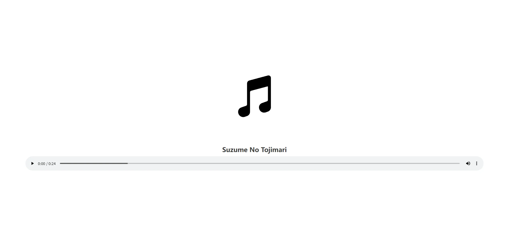
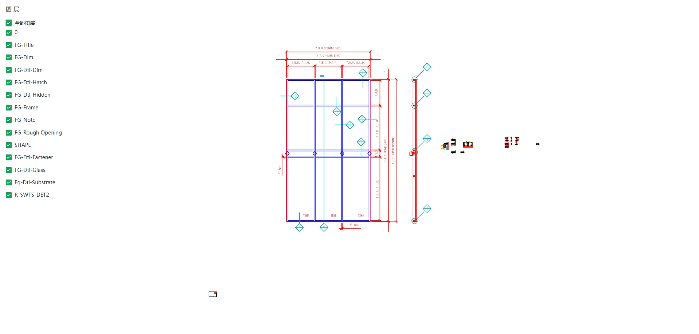
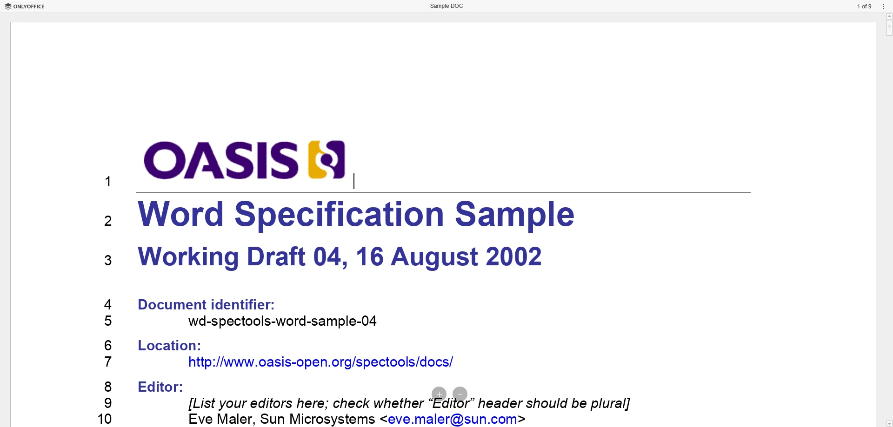

# @pangju/file-viewer

基于 `Vue 3` 和 [`Naive UI`](https://www.naiveui.com/zh-CN/os-theme/docs/introduction)
打造的高集成度文件预览组件，致力于集成各类常用格式的预览能力，提供统一且高度可定制的交互体验。

## 📂 支持的文件类型

| 类型             | 后缀                                                                                      | 
|----------------|-----------------------------------------------------------------------------------------|
| **图片**         | .jpg, .jpeg, .jpe, .jfif, .png, .gif, .bmp, .dib, .webp, .svg, .avif, ico               |                                                                                                                                                                                                          |
| **视频**         | .mp4, .m4v, .webm, .ogg, .ogv, .m3u8, .mpd                                              |                                                                                                                                                                                                                           |
| **音频**         | .mp3, .mp2, .mp1, .mpga, .m4a, .mp4, .aac, .ogg, .oga, .wav, .wave, .webm, .opus, .flac |                                                                                                                                                                
| **PDF文档**      | .pdf                                                                                    |                                                                                          
| **Office**     | .doc, .docx, .xls, .xlsx, .ppt, .pptx                                                   | 
| **3D 模型**      | .glb, .gltf, .obj, .stl                                                                 | 
| **DXF矢量图**     | .dxf                                                                                    | 
| **JSON**       | .json                                                                                   |                                                                                                                                                                                    
| **Markdown文档** | .md                                                                                     |                                                                                                                                                                                                
| **纯文本**        | .txt, .js, .ts, .css, .html 等                                                           |

## 预览图


## 在线示例

## 📦 安装

```bash
pnpm add @pangju/file-viewer

yarn add @pangju/file-viewer

npm install @pangju/file-viewer
```

## 🚀 快速开始

### 全局注册

在你的 `main.ts` 或 `main.js` 中注册插件：

```javascript
import {createApp} from 'vue'
import App from './App.vue'
import FileViewer from '@pangju/file-viewer'
import '@pangju/file-viewer/index.css'

const app = createApp(App)
app.use(FileViewer)
app.mount('#app')
```

### 局部引入

你也可以在组件中直接引入：

```vue
<script setup>
  import {FileViewer} from '@pangju/file-viewer'
  import '@pangju/file-viewer/index.css'
  import {ref} from "vue";

  const fileItems = ref([
    {
      source: "https://disk.sample.cat/samples/pdf/sample-a4.pdf",
      mimeType: "application/pdf",
      name: "Sample A4 PDF",
      type: "PDF文档",
      cover: "https://07akioni.oss-cn-beijing.aliyuncs.com/07akioni.jpeg",
      tags: ["测试文件", "示例PDF"],
      size: 10000000,
      descriptions: [
        {
          name: "创建事件",
          value: "2026-3-18",
        },
        {
          name: "创建作者",
          value: "胖橘",
        },
      ],
    },
    {
      source: "https://disk.sample.cat/samples/png/monalisa-1200x1200.png",
      mimeType: "application/pdf",
      name: "Monalisa 1200x1200",
      type: {
        label: "图像",
        value: "image",
      },
      cover: "https://07akioni.oss-cn-beijing.aliyuncs.com/07akioni.jpeg",
      tags: [
        {
          value: "测试文件",
          type: "info",
        },
        {
          value: "测试文件",
          type: "success",
        }
      ],
      size: 10000000,
      descriptions: [
        {
          name: "创建事件",
          value: "2026-3-18",
        },
        {
          name: "创建作者",
          value: "胖橘",
        },
      ],
    },
  ]);
</script>

<template>
  <file-viewer :data="fileItems"/>
</template>
```

## 数据结构

### FileType

文件类型信息的结构定义。

```typescript
export type FileType = { label: string; value: string; } | string;
```

> 💡 **提示**：
> 
> `label`用于定义文件类型的显示文本，未定义则直接使用`value`作为显示文本。

<details>
<summary>展开查看示例</summary>

#### 示例
```javascript
const fileTypes = [
    {
        label: "图片", // 图片作为显示文本
        value: "image", // image作为值
    },
    {
        value: "图片", // 图片作为显示文本和值
    },
    "图片"  // 图片作为显示文本和值
]
```

</details>

### FileItem

文件信息的结构定义。

```typescript
export type FileItem = {
    source: string | File | Blob; // 源：URL、File 对象或 Blob
    mimeType?: string;           // MIME 类型（undefined 或为 null 时尝试使用 Blob 或 File 类型的 type 属性获取）
    id?: string;                // 唯一标识符
    name?: string;              // 名称（未定义时尝试使用 File 类型的 name 属性获取）
    type?: string | { label: string; value: string }; // 类型
    cover?: string;             // 封面图 URL
    size?: number;              // 大小（单位：字节）（undefined 或为 null 时尝试使用 Blob 或 File 类型的 size 属性获取）
    tags?: string[] | { value: string; type?: "default" | "primary" | "info" | "success" | "warning" | "error" }[]; // 标签集合
    descriptions?: { name: string; value: string }[];    // 描述信息
};
```

> 💡 **提示**：
>
> 内置的`Pdf`和`Office`预览组件只支持公网`URL`，所以无法使用`File`或`Blob`类型作为文件源（`FileItem.source`）。

<details>
<summary>展开查看示例</summary>

#### 示例
```javascript
const fileItems = [
    {
        source: "https://disk.sample.cat/samples/pdf/sample-a4.pdf",
        mimeType: "application/pdf",
        name: "Sample A4 PDF",
        type: "PDF文档",
        cover: "https://07akioni.oss-cn-beijing.aliyuncs.com/07akioni.jpeg",
        tags: ["测试文件", "示例PDF"],
        size: 10000000,
        descriptions: [
            {
                name: "创建事件",
                value: "2026-3-18",
            },
            {
                name: "创建作者",
                value: "胖橘",
            },
        ],
    },
    {
        source: "https://disk.sample.cat/samples/png/monalisa-1200x1200.png",
        mimeType: "application/pdf",
        name: "Monalisa 1200x1200",
        type: {
            label: "图像",
            value: "image",
        },
        cover: "https://07akioni.oss-cn-beijing.aliyuncs.com/07akioni.jpeg",
        tags: [
            {
                value: "测试文件", 
                type: "info",
            }, 
            {
                value: "测试文件", 
                type: "success",
            }
        ],
        size: 10000000,
        descriptions: [
            {
                name: "创建事件",
                value: "2026-3-18",
            },
            {
                name: "创建作者",
                value: "胖橘",
            },
        ],
    },
]
```

</details>

## 🧩 组件

### FileViewer

多文件预览组件，使用[`Naive UI Spin`](https://www.naiveui.com/zh-CN/os-theme/components/spin)集成了[单文件预览](#filepreview)（左侧）和[文件列表](#filelist)（右侧）。

> 💡 **提示**：
>
> 根据文件内容自动检测 `MIME` 类型触发条件：
> 1. `autoDetectType`属性为`true`
> 2. [`FileItem`](#fileitem)的`mimeType`属性`undefined`或为`null`
> 3. 当`source`为`Blob`或`File`类型时`type`属性`undefined`或为`null`

#### 属性

除了继承自[`FileList`](#filelist)和[`FilePreview`](#filepreview)的属性外，还包含以下属性：

| 名称                 | 类型                                              | 默认值                                                                         | 说明                                                                                                                     |
|--------------------|-------------------------------------------------|-----------------------------------------------------------------------------|------------------------------------------------------------------------------------------------------------------------|
| `minSplitSize`     | `number \| string`                              | `0.1`                                                                       | 预览面板最小宽度比例（源自[`Naive UI Split`](https://www.naiveui.com/zh-CN/os-theme/components/split#Split-Props)的`min`属性)          |
| `maxSplitSize`     | `number \| string`                              | `0.9`                                                                       | 预览面板最大宽度比例（源自[`Naive UI Split`](https://www.naiveui.com/zh-CN/os-theme/components/split#Split-Props)的`max`属性)          |
| `defaultSplitSize` | `number \| string`                              | `0.8`                                                                       | 预览面板默认宽度比例（源自[`Naive UI Split`](https://www.naiveui.com/zh-CN/os-theme/components/split#Split-Props)的`default-size`属性) |
| `autoDetectType`   | `boolean`                                       | `true`                                                                      | 是否根据文件内容自动检测 `MIME Type`                                                                                               |
| `detectFileType`   | `(file: FileItem) => string \| Promise<string>` | 使用[`file-type`](https://www.npmjs.com/package/file-type?activeTab=readme)实现 | 自定义文件类型检测函数（当`autoDetectType`为`true`时生效），类型参考[FileItem](#fileitem)                                                     |
| `showLoading`      | `boolean`                                       | `true`                                                                      | 是否显示加载提示                                                                                                               |
| `loadingText`      | `string`                                        | `"正在加载中..."`                                                                | 加载提示文本（源自[`Naive UI Spin`](https://www.naiveui.com/zh-CN/os-theme/components/spin#Spin-Props)的`description`属性)         |
| `loadingSize`      | `"small" \| "medium" \| "large" \| number`      | `"large"`                                                                   | 加载图标大小（源自[`Naive UI Spin`](https://www.naiveui.com/zh-CN/os-theme/components/spin#Spin-Props)的`size`属性)                |

#### 事件

| 名称              | 参数                 | 说明                                                                |
|-----------------|--------------------|-------------------------------------------------------------------|
| `loading-start` | `()`               | 开始加载文件时触发（`showLoading`为`false`时才会触发）                             |
| `loading-end`   | `()`               | 文件加载完成时触发（`showLoading`为`false`时才会触发）                             |
| `loading-error` | `()`               | 文件加载失败时触发（`showLoading`为`false`时才会触发）                             |
| `click-file`    | `(file: FileItem)` | 点击列表中的文件时触发（`showLoading`为`false`时才会触发），类型参考[FileItem](#fileitem) |

#### 方法

| 名称           | 参数                 | 说明                                                |
|--------------|--------------------|---------------------------------------------------|
| `changeFile` | `(file: FileItem)` | 修改当前预览文件（主要结合自定义文件列表使用），类型参考[FileItem](#fileitem) |

#### 插槽

| 名称        | 参数                        | 说明                                                            |
|-----------|---------------------------|---------------------------------------------------------------|
| `list`    | `()`                      | 右侧文件列表的展示                                                     |
| `preview` | `(currentFile: FileItem)` | 左侧预览区域的展示（`showLoading`为`false`时生效），类型参考[FileItem](#fileitem) |

### FileList

文件列表组件，默认使用卡片形式展示[`文件信息`](#fileitem)

> 💡 **提示**：
>
> 如果是一次性传入所有文件数据请使用`data`属性，如果需要分页加载请使用`onLoad`属性。
> 
> `onLoad`属性优先级大于`data`属性。

#### 预览图


#### 属性

| 属性                     | 类型                                                                                       | 默认值                                 | 说明                                                                                                                     |
|------------------------|------------------------------------------------------------------------------------------|-------------------------------------|------------------------------------------------------------------------------------------------------------------------|
| `title`                | `string`                                                                                 | `"文件列表"`                            | 标题                                                                                                                     |
| `data`                 | `FileItem[] \| Promise<FileItem[]> \| (() => FileItem[]) \| (() => Promise<FileItem[]>)` | `undefined`                         | 文件数据（如果传入`onLoad`，则该属性无效），类型参考[FileItem](#fileitem)                                                                    |
| `showBackTop`          | `boolean`                                                                                | `true`                              | 是否显示回到顶部按钮                                                                                                             |
| `showSearch`           | `boolean`                                                                                | `true`                              | 是否显示搜索框                                                                                                                |
| `showTitle`            | `boolean`                                                                                | `true`                              | 是否显示标题                                                                                                                 |
| `showFilter`           | `boolean`                                                                                | `true`                              | 是否显示过滤器                                                                                                                |
| `coverHeight`          | `number \| string`                                                                       | `150`                               | 封面图片高度（源自[`Naive UI Image`](https://www.naiveui.com/zh-CN/os-theme/components/image#Image-Props)的`height`属性)           |
| `coverObjectFit`       | `"fill" \| "contain" \| "cover" \| "none" \| "scale-down"`                               | `"fill"`                            | 封面图片缩放模式（源自[`Naive UI Image`](https://www.naiveui.com/zh-CN/os-theme/components/image#Image-Props)的`object-fit`属性)     |
| `coverLazy`            | `boolean`                                                                                | `false`                             | 是否懒加载封面图片（源自[`Naive UI Image`](https://www.naiveui.com/zh-CN/os-theme/components/image#Image-Props)的`lazy`属性)          |
| `coverFallbackSrc`     | `string`                                                                                 | `undefined`                         | 封面图片加载失败时显示的地址                                                                                                         |
| `coverFallbackIcon`    | `Component`                                                                              | `Image(@vicons/ionicons5)`          | 封面图片加载失败时显示的图标组件（源自[`Naive UI Icon`](https://www.naiveui.com/zh-CN/os-theme/components/icon#Icon-Props)的`component`属性) |
| `coverPlaceholderSrc`  | `string`                                                                                 | `undefined`                         | 封面图片加载中显示的地址                                                                                                           |
| `coverPlaceholderIcon` | `Component`                                                                              | `Image(@vicons/ionicons5)`          | 封面图片加载中显示的图标组件（源自[`Naive UI Icon`](https://www.naiveui.com/zh-CN/os-theme/components/icon#Icon-Props)的`component`属性)   |
| `cardSize`             | `"small" \| "medium" \| "large" \| "huge"`                                               | `"small"`                           | 文件卡片大小（源自[`Naive UI Card`](https://www.naiveui.com/zh-CN/os-theme/components/card#Card-Props)的`size`属性)                |
| `cardHoverable`        | `boolean`                                                                                | `true`                              | 文件卡片是否可悬浮（源自[`Naive UI Card`](https://www.naiveui.com/zh-CN/os-theme/components/card#Card-Props)的`hoverable`属性)        |
| `cardBordered`         | `boolean`                                                                                | `true`                              | 文件卡片是否有边框（源自[`Naive UI Card`](https://www.naiveui.com/zh-CN/os-theme/components/card#Card-Props)的`bordered`属性)         |
| `types`                | `FileType[] \| Promise<FileType[]> \| (() => FileType[]) \| (() => Promise<FileType[]>)` | `undefined`                         | 文件类型数据（用于默认的过滤器组件数据），类型参考[FileType](#filetype)                                                                         |
| `filter`               | `(file: FileItem, types: string[], keyword?: string) => boolean`                         | 使用文件名和文件类型（`type`而不是`mimeType`）进行过滤 | 自定义文件数据搜索/过滤方法（如果传入`onLoad`，则该属性无效），类型参考[FileItem](#fileitem)                                                          |
| `onLoad`               | `(page: number, types: string[], keyword?: string) => Promise<FileItem[]> \| FileItem[]` | `undefined`                         | 异步加载文件数据方法（传入后`filter`和`data`将失效，全权由`onLoad`来定义如何获取和过滤结果），类型参考[FileItem](#fileitem)                                    |
| `noMore`               | `boolean`                                                                                | `undefined`                         | 是否已加载全部数据（如果未传入`onLoad`，则该属性无效）                                                                                        |
| `customDownload`       | `(fileItem: FileItem) => void`                                                           | 使用`a`标签下载                           | 自定义下载方法，类型参考[FileItem](#fileitem)                                                                                      |

#### 事件

| 名称           | 参数                 | 说明                                    |
|--------------|--------------------|---------------------------------------|
| `click-file` | `(file: FileItem)` | 点击列表中的文件时触发，类型参考[FileItem](#fileitem) |

#### 方法

| 名称            | 参数   | 说明                       |
|---------------|------|--------------------------|
| `refreshData` | `()` | 刷新文件数据（主要结合自定义搜索框和过滤器使用） |

#### 插槽

| 名称                  | 参数                       | 说明                                                   |
|---------------------|--------------------------|------------------------------------------------------|
| `title`             | `()`                     | 文件列表标题的展示（`showTitle`为`true`时生效）                     |
| `search`            | `()`                     | 搜索框的展示（`showSearch`为`true`时生效，需要结合`refreshData`方法使用） |
| `filter`            | `()`                     | 过滤器的展示（`showFilter`为`true`时生效，需要结合`refreshData`方法使用） |
| `loading`           | `()`                     | 文件数据加载中的展示                                           |
| `empty`             | `()`                     | 文件列表为空的展示                                            |
| `noMore`            | `()`                     | 没有更多数据的展示                                            |
| `backTop`           | `()`                     | 回到顶部按钮的展示                                            |
| `list`              | `(fileList: FileItem[])` | 文件列表的展示，类型参考[FileItem](#fileitem)                    |
| `file-name`         | `(fileItem: FileItem)`   | 文件名称的展示，类型参考[FileItem](#fileitem)                    |
| `file-type`         | `(fileItem: FileItem)`   | 文件类型的展示，类型参考[FileItem](#fileitem)                    |
| `file-cover`        | `(fileItem: FileItem)`   | 文件封面的展示，类型参考[FileItem](#fileitem)                    |
| `file-tags`         | `(fileItem: FileItem)`   | 文件标签集合的展示，类型参考[FileItem](#fileitem)                  |
| `file-action`       | `(fileItem: FileItem)`   | 文件操作的展示，类型参考[FileItem](#fileitem)                    |
| `file-action-extra` | `(fileItem: FileItem)`   | 文件额外操作的展示，类型参考[FileItem](#fileitem)                  |
| `file-size`         | `(fileItem: FileItem)`   | 文件大小格式化的展示，类型参考[FileItem](#fileitem)                 |
| `file-descriptions` | `(fileItem: FileItem)`   | 文件描述的展示，类型参考[FileItem](#fileitem)                    |

### FilePreview

单文件预览组件，根据文件的`mimeType`渲染不同类型的预览组件。

| 组件名称                                | 对应`mimeType`                                                                                                                                                                                                                                                                                                   | 组件说明              |
|:------------------------------------|:---------------------------------------------------------------------------------------------------------------------------------------------------------------------------------------------------------------------------------------------------------------------------------------------------------------|:------------------|
| [`AudioViewer`](#audioviewer)       | `image/`(`jpeg`, `png`, `gif`, `bmp`, `webp`, `svg+xml`, `avif`, `x-icon`)                                                                                                                                                                                                                                     | `音频`预览组件。         |
| [`VideoViewer`](#videoviewer)       | `video/`(`mp4`, `webm`, `ogg`), `application/x-mpegURL`, `application/vnd.apple.mpegurl`, `application/dash+xml`                                                                                                                                                                                               | `视频`预览组件。         |
| [`ImageViewer`](#imageviewer)       | `audio/`(`mpeg`, `mp4`, `aac`, `ogg`, `wav`, `webm`, `opus`, `flac`)                                                                                                                                                                                                                                           | `图片`预览组件。         |
| [`DxfViewer`](#dxfviewer)           | `image/vnd.dxf`                                                                                                                                                                                                                                                                                                | `DXF`矢量图预览组件。     |
| [`JsonViewer`](#jsonviewer)         | `application/json`                                                                                                                                                                                                                                                                                             | `JSON`文件预览组件。     |
| [`MarkdownViewer`](#markdownviewer) | `text/x-web-markdown`                                                                                                                                                                                                                                                                                          | `Markdown`文件预览组件。 |
| [`TextViewer`](#textviewer)         | `text/*`                                                                                                                                                                                                                                                                                                       | `纯文本`文件预览组件。      |
| [`PdfViewer`](#pdfviewer)           | `application/pdf`                                                                                                                                                                                                                                                                                              | `PDF`文件预览组件。      |
| [`OfficeViewer`](#officeviewer)     | `application/msword`, `application/vnd.openxmlformats-officedocument.wordprocessingml.document`, `application/vnd.ms-excel`, `application/vnd.openxmlformats-officedocument.spreadsheetml.sheet`, `application/vnd.ms-powerpoint`, `application/vnd.openxmlformats-officedocument.presentationml.presentation` | `Office`文档预览组件。   |
| [`ModelViewer`](#modelviewer)       | `model/`(`gltf-binary`, `gltf+json`, `obj`, `x.stl-binary`)                                                                                                                                                                                                                                                    | `3D模型`预览组件。       |

> 💡 **提示**：
>
> 内置的`Pdf`和`Office`预览组件只支持公网`URL`，所以无法使用`File`或`Blob`类型作为文件源（`FileItem.source`）。

#### 属性

| 属性                    | 类型                                                                                                                                                                                                                                                                                                                                            | 默认值         | 说明                                                                                                                                                                                                                                                                                                                                                                                                                                   |
|-----------------------|-----------------------------------------------------------------------------------------------------------------------------------------------------------------------------------------------------------------------------------------------------------------------------------------------------------------------------------------------|-------------|--------------------------------------------------------------------------------------------------------------------------------------------------------------------------------------------------------------------------------------------------------------------------------------------------------------------------------------------------------------------------------------------------------------------------------------|
| `file`                | `FileItem`                                                                                                                                                                                                                                                                                                                                    | `undefined` | 需要预览的[文件信息](#fileitem)                                                                                                                                                                                                                                                                                                                                                                                                               |
| `enableImage`         | `boolean`                                                                                                                                                                                                                                                                                                                                     | `true`      | 是否启用`图片`文件预览                                                                                                                                                                                                                                                                                                                                                                                                                         |
| `enableVideo`         | `boolean`                                                                                                                                                                                                                                                                                                                                     | `true`      | 是否启用`视频`文件预览                                                                                                                                                                                                                                                                                                                                                                                                                         |
| `enableAudio`         | `boolean`                                                                                                                                                                                                                                                                                                                                     | `true`      | 是否启用`音频`文件预览                                                                                                                                                                                                                                                                                                                                                                                                                         |
| `enablePdf`           | `boolean`                                                                                                                                                                                                                                                                                                                                     | `true`      | 是否启用`PDF`文件预览                                                                                                                                                                                                                                                                                                                                                                                                                        |
| `enableOffice`        | `boolean`                                                                                                                                                                                                                                                                                                                                     | `true`      | 是否启用`Office`文件预览                                                                                                                                                                                                                                                                                                                                                                                                                     |
| `enableModel`         | `boolean`                                                                                                                                                                                                                                                                                                                                     | `true`      | 是否启用`3D 模型`文件预览                                                                                                                                                                                                                                                                                                                                                                                                                      |
| `enableMarkdown`      | `boolean`                                                                                                                                                                                                                                                                                                                                     | `true`      | 是否启用`Markdown 文档`文件预览                                                                                                                                                                                                                                                                                                                                                                                                                |
| `enableText`          | `boolean`                                                                                                                                                                                                                                                                                                                                     | `true`      | 是否启用`纯文本`文件预览                                                                                                                                                                                                                                                                                                                                                                                                                        |
| `enableJson`          | `boolean`                                                                                                                                                                                                                                                                                                                                     | `true`      | 是否启用`JSON`文件预览                                                                                                                                                                                                                                                                                                                                                                                                                       |
| `enableDxf`           | `boolean`                                                                                                                                                                                                                                                                                                                                     | `true`      | 是否启用`DXF 矢量图`文件预览                                                                                                                                                                                                                                                                                                                                                                                                                    |
| `customViewerMatcher` | `string[] \| ((file: FileItem) => boolean)`                                                                                                                                                                                                                                                                                                   | `undefined` | 自定义文件预览匹配逻辑（用于判断是否使用自定义预览组件），类型参考[FileItem](#fileitem)                                                                                                                                                                                                                                                                                                                                                                               |
| `viewerOptions`       | `{ audio?: Record<string, unknown>; dxf?: Record<string, unknown>; image?: Record<string, unknown>; json?: Record<string, unknown>; markdown?: Record<string, unknown>; model?: Record<string, unknown>; office?: Record<string, unknown>; pdf?: Record<string, unknown>; video?: Record<string, unknown>; text?: Record<string, unknown>; }` | `undefined` | 各类型文件预览组件的专属配置对象：<br>• `audio`: [`音频`预览组件](#audioviewer)<br>• `video`: [`视频`预览组件](#videoviewer)<br>• `image`: [`图片`预览组件](#imageviewer)<br>• `pdf`: [`PDF`预览组件](#pdfviewer)<br>• `office`: [`Office`预览组件](#officeviewer)<br>• `model`: [`3D模型`预览组件](#modelviewer)<br>• `dxf`: [`DXF`预览组件](#dxfviewer)<br>• `json`: [`JSON`预览组件](#jsonviewer)<br>• `markdown`: [`Markdown`预览组件](#markdownviewer)<br>• `text`: [`纯文本`预览组件](#textviewer) |

#### 事件

| 名称              | 参数   | 说明        |
|-----------------|------|-----------|
| `loading-start` | `()` | 开始加载文件时触发 |
| `loading-end`   | `()` | 文件加载完成时触发 |
| `loading-error` | `()` | 文件加载失败时触发 |

#### 方法

| 名称         | 参数                                   | 说明                                           |
|------------|--------------------------------------|----------------------------------------------|
| `setError` | `(reason?: string, error?: unknown)` | 报告文件预览失败（`reason`为错误原因，`error`为各类型预览组件抛出的错误） |

#### 插槽

| 名称         | 参数                                                                                                               | 说明                    |
|------------|------------------------------------------------------------------------------------------------------------------|-----------------------|
| `error`    | `(reason?: string, filename?: string, fileUrl: string, mimeType: string, fileEncoding: string, error?: unknown)` | 预览组件渲染错误时的展示          |
| `custom`   | `(filename?: string, fileUrl: string, mimeType: string, fileEncoding: string)`                                   | 用户自定义文件预览组件的展示        |
| `audio`    | `(filename?: string, fileUrl: string, mimeType: string, fileEncoding: string)`                                   | `音频`文件预览时的展示          |
| `image`    | `(filename?: string, fileUrl: string, mimeType: string, fileEncoding: string)`                                   | `图片`文件预览时的展示          |
| `video`    | `(filename?: string, fileUrl: string, mimeType: string, fileEncoding: string)`                                   | `视频`文件预览时的展示          |
| `model`    | `(filename?: string, fileUrl: string, mimeType: string, fileEncoding: string)`                                   | `3D 模型`文件预览时的展示       |
| `office`   | `(filename?: string, fileUrl: string, mimeType: string, fileEncoding: string)`                                   | `Office`文件预览时的展示      |
| `markdown` | `(filename?: string, fileUrl: string, mimeType: string, fileEncoding: string)`                                   | `Markdown 文档`文件预览时的展示 |
| `dxf`      | `(filename?: string, fileUrl: string, mimeType: string, fileEncoding: string)`                                   | `DXF 矢量图`文件预览时的展示     |
| `pdf`      | `(filename?: string, fileUrl: string, mimeType: string, fileEncoding: string)`                                   | `PDF`文件预览时的展示         |
| `json`     | `(filename?: string, fileUrl: string, mimeType: string, fileEncoding: string)`                                   | `JSON`文件预览时的展示        |
| `text`     | `(filename?: string, fileUrl: string, mimeType: string, fileEncoding: string)`                                   | `纯文本`文件预览时的展示         |
| `unknown`  | `(filename?: string, fileUrl: string, mimeType: string, fileEncoding: string)`                                   | 没有对应预览组件的文件预览时的展示     |

### AudioViewer

`音频`预览组件，使用`audio`标签实现

#### 预览图



#### 属性

| 属性                  | 类型                                                         | 默认值                              | 说明                                                                                                                         |
|---------------------|------------------------------------------------------------|----------------------------------|----------------------------------------------------------------------------------------------------------------------------|
| `src`               | `string`                                                   | `undefined`                      | 音频文件的`URL`                                                                                                                 |
| `title`             | `string`                                                   | `undefined`                      | 音频的标题                                                                                                                      |
| `cover`             | `string`                                                   | `cover`                          | 音频封面图片`URL`                                                                                                                |
| `autoplay`          | `boolean`                                                  | `false`                          | 是否启用自动播放（源自`audio`标签）                                                                                                      |
| `controls`          | `boolean`                                                  | `true`                           | 是否启用控制面板（源自`audio`标签）                                                                                                      |
| `coverHeight`       | `number`                                                   | `180`                            | 封面图片高度（源自[`Naive UI Image`](https://www.naiveui.com/zh-CN/os-theme/components/image#Image-Props)的`width`属性)                |
| `coverObjectFit`    | `"fill" \| "contain" \| "cover" \| "none" \| "scale-down"` | `"cover"`                        | 封面图片缩放模式（源自[`Naive UI Image`](https://www.naiveui.com/zh-CN/os-theme/components/image#Image-Props)的`object-fit`属性)         |
| `coverFallbackSrc`  | `string`                                                   | `undefined`                      | 封面图片加载失败时显示的地址（源自[`Naive UI Image`](https://www.naiveui.com/zh-CN/os-theme/components/image#Image-Props)的`fallback-src`属性) |
| `coverFallbackIcon` | `Component`                                                | `MusicalNote(@vicons/ionicons5)` | 封面图片加载失败时显示的图标组件（源自[`Naive UI Icon`](https://www.naiveui.com/zh-CN/os-theme/components/icon#Icon-Props)的`component`属性)     |

#### 事件

| 名称      | 参数                    | 说明                             |
|---------|-----------------------|--------------------------------|
| `ready` | `()`                  | 音频可以播放时触发                      |
| `error` | `(error: MediaError)` | 音频播放失败时触发（`error`由`audio`标签抛出） |

### VideoViewer

`视频`预览组件，使用[`video.js`](https://www.npmjs.com/package/video.js)实现

#### 预览图


#### 属性

| 属性              | 类型                                            | 默认值                                                      | 说明                                                                  |
|-----------------|-----------------------------------------------|----------------------------------------------------------|---------------------------------------------------------------------|
| `src`           | `{ url: string; mimeType: string } \| string` | `undefined`                                              | 视频文件的`URL`                                                          |
| `poster`        | `string`                                      | `undefined`                                              | 视频封面图片的`URL`                                                        |
| `playerOptions` | `Record<string, unknown>`                     | `{ language: "zh-CN", autoplay: false, controls: true }` | `videojs`方法的[`options`](https://legacy.videojs.org/guides/options/) |

#### 事件

| 名称      | 参数                    | 说明                             |
|---------|-----------------------|--------------------------------|
| `ready` | `()`                  | 视频可以播放时触发                      |
| `error` | `(error: MediaError)` | 视频播放失败时触发（`error`由`videojs`抛出） |

### ImageViewer

`图片`预览组件，使用[`Viewer.js`](https://www.npmjs.com/package/viewerjs)实现

> 💡 **提示**：
>
> `Viewer.js`的`{ inline: true, navbar: false, button: false }`为固定配置。
> 
> `Viewer.js`的`title`属性默认为（`${props.title} ${imageData.naturalWidth}x${imageData.naturalHeight}`）

#### 预览图


#### 属性

| 属性              | 类型                        | 默认值                                                                                                                                                                                              | 说明                                                                       |
|-----------------|---------------------------|--------------------------------------------------------------------------------------------------------------------------------------------------------------------------------------------------|--------------------------------------------------------------------------|
| `src`           | `string`                  | `undefined`                                                                                                                                                                                      | 图片文件的`URL`                                                               |
| `title`         | `string`                  | `undefined`                                                                                                                                                                                      | 图片标题                                                                     |
| `viewerOptions` | `Record<string, unknown>` | `{ toolbar: { flipHorizontal: true, flipVertical: true, next: false, oneToOne: true, play: false, prev: false, reset: true, rotateLeft: true, rotateRight: true, zoomIn: true, zoomOut: true }}` | `Viewer`构造方法的[`options`](https://www.npmjs.com/package/viewerjs#options) |

#### 事件

| 名称      | 参数   | 说明                                   |
|---------|------|--------------------------------------|
| `ready` | `()` | 图片加载完成时触发（由`Viewer.js`的`viewed`事件发出） |
| `error` | `()` | 浏览器加载图片失败时触发                         |

### DxfViewer

`DXF`预览组件，使用[`dxf-viewer`](https://www.npmjs.com/package/dxf-viewer)实现

> 💡 **提示**：
> 
> 建议不要修改`viewerOptions`属性，我没找到官方文档，默认配置也是我参考示例代码写的。
>
> 需要配置`fonts`属性传入一些字体（官方示例有几个字体：[传送门](https://github.com/vagran/dxf-viewer-example-src/tree/master/src/assets/fonts)），否则文字无法正常显示。

#### 属性

| 属性                 | 类型                        | 默认值                                                                                                                                             | 说明                                                                                                                         |
|--------------------|---------------------------|-------------------------------------------------------------------------------------------------------------------------------------------------|----------------------------------------------------------------------------------------------------------------------------|
| `src`              | `string`                  | `undefined`                                                                                                                                     | `DXF`文件的`URL`                                                                                                              |
| `showProgressBar`  | `boolean`                 | `true`                                                                                                                                          | 是否显示加载进度条                                                                                                                  |
| `showLayerList`    | `boolean`                 | `true`                                                                                                                                          | 是否显示图层列表                                                                                                                   |
| `layerListWidth`   | `number \| string`        | `300`                                                                                                                                           | 图层列表宽度（源自[`Naive UI Layout-Sider`](https://www.naiveui.com/zh-CN/os-theme/components/layout#Layout-Sider-Props)的`width`属性) |
| `fonts`            | `string[]`                | `[]`                                                                                                                                            | 渲染使用到的字体                                                                                                                   |
| `dxfViewerOptions` | `Record<string, unknown>` | `{ fileEncoding: "utf-8", clearColor: new Three.Color("#fff"), autoResize: true, colorCorrection: true, sceneOptions: { wireframeMesh: true }}` | `DxfViewer`构造方法的`options`，请参考[`DXF Viewer 源码 第691行`](https://github.com/vagran/dxf-viewer/blob/master/src/DxfViewer.js)    |

#### 事件

| 名称         | 参数                                                                                             | 说明                                                                                                                                                                                                                                                 |
|------------|------------------------------------------------------------------------------------------------|----------------------------------------------------------------------------------------------------------------------------------------------------------------------------------------------------------------------------------------------------|
| `ready`    | `()`                                                                                           | `DXF`加载完成时触发                                                                                                                                                                                                                                       |
| `error`    | `(error: Error)`                                                                               | `DXF`加载失败时触发(`error`由`dxf-viewer`的`Load`方法抛出)                                                                                                                                                                                                      |
| `progress` | `(phase: "font" \| "fetch" \| "parse" \| "prepare", processedSize: number, totalSize: number)` | `DXF`加载时抛出。<br>**参数说明**：<br>• `phase`: 当前加载阶段<br>&nbsp;&nbsp;- `font`: 加载字体资源<br>&nbsp;&nbsp;- `fetch`: 下载文件数据<br>&nbsp;&nbsp;- `parse`: 解析文件内容<br>&nbsp;&nbsp;- `prepare`: 准备渲染数据<br>• `processedSize`: 已加载/处理的大小（字节）<br>• `totalSize`: 资源总大小（字节） |

#### 示例



```vue
<template>
  <dxf-viewer src="https://raw.githubusercontent.com/gdsestimating/dxf-parser/refs/heads/master/samples/data/api-cw750-details.dxf" class="pangju-wh-100" :fonts="fonts" />
</template>

<script setup>
import {DxfViewer} from "@pangju/file-viewer";
import {ref} from "vue";

import HanaMinAFont from "@/assets/fonts/HanaMinA.ttf";
import NanumGothicRegularFont from "@/assets/fonts/HanaMinA.ttf";
import NotoSansDisplaySemiCondensedLightItalicFont from "@/assets/fonts/HanaMinA.ttf";
import RobotoLightItalicFont from "@/assets/fonts/HanaMinA.ttf";

const fonts = ref([
  HanaMinAFont, NanumGothicRegularFont, NotoSansDisplaySemiCondensedLightItalicFont, RobotoLightItalicFont
]);
</script>
```

### JsonViewer

`JSON`预览组件，使用[`vue3-json-viewer`](https://www.npmjs.com/package/vue3-json-viewer)实现

#### 预览图


#### 属性

| 属性                | 类型                                                                                                   | 默认值                                                   | 说明                                                                                    |
|-------------------|------------------------------------------------------------------------------------------------------|-------------------------------------------------------|---------------------------------------------------------------------------------------|
| `src`             | `string \| { url: string; fileEncoding?: string }`                                                   | `undefined`                                           | `JSON`文件的`URL`                                                                        |
| `contentLoader`   | `(url: string, fileEncoding: string) => Record<string, unknown> \| Promise<Record<string, unknown>>` | 使用`fetch`下载                                           | 自定义从`URL`加载文件内容的方法                                                                    |
| `jsonViewerProps` | `Record<string, unknown>`                                                                            | `{ copyable: true, expanded: true, expandDepth: 10 }` | [`JsonViewer 属性`](https://vjv-doc-qiuquanwu.vercel.app/#typescript%E6%94%AF%E6%8C%81) |

#### 事件

| 名称      | 参数               | 说明                             |
|---------|------------------|--------------------------------|
| `ready` | `()`             | 文件内容加载完成时触发                    |
| `error` | `(error: Error)` | 文件内容加载失败时触发（`error`由`fetch`抛出） |

### MarkdownViewer

`Markdown`预览组件，使用[`md-editor-v3`](https://www.npmjs.com/package/md-editor-v3)实现

#### 预览图


#### 属性

| 属性               | 类型                                                                 | 默认值         | 说明                                                                                                 |
|------------------|--------------------------------------------------------------------|-------------|----------------------------------------------------------------------------------------------------|
| `src`            | `string \| { url: string; fileEncoding?: string }`                 | `undefined` | `Markdown`文件的`URL`                                                                                 |
| `showCatalog`    | `boolean`                                                          | `true`      | 是否显示目录                                                                                             |
| `catalogWidth`   | `number`                                                           | `350`       | 目录宽度                                                                                               |
| `contentLoader`  | `(url: string, fileEncoding: string) => string \| Promise<string>` | 使用`fetch`下载 | 自定义从`URL`加载文件内容的方法                                                                                 |
| `mdPreviewProps` | `Record<string, unknown>`                                          | `undefined` | [`MdPreview 属性`](https://imzbf.github.io/md-editor-v3/zh-CN/api/#%F0%9F%94%96%20MdPreview%20Props) |

#### 事件

| 名称      | 参数               | 说明                             |
|---------|------------------|--------------------------------|
| `ready` | `()`             | 文件内容加载完成时触发                    |
| `error` | `(error: Error)` | 文件内容加载失败时触发（`error`由`fetch`抛出） |

### TextViewer

`纯文本`预览组件，使用`pre`元素实现

#### 示例图


#### 属性

| 属性              | 类型                                                                 | 默认值         | 说明                 |
|-----------------|--------------------------------------------------------------------|-------------|--------------------|
| `src`           | `string \| { url: string; fileEncoding?: string }`                 | `undefined` | `纯文本`文件的`URL`      |
| `contentLoader` | `(url: string, fileEncoding: string) => string \| Promise<string>` | 使用`fetch`下载 | 自定义从`URL`加载文件内容的方法 |

#### 事件

| 名称      | 参数               | 说明                             |
|---------|------------------|--------------------------------|
| `ready` | `()`             | 文件内容加载完成时触发                    |
| `error` | `(error: Error)` | 文件内容加载失败时触发（`error`由`fetch`抛出） |

### PdfViewer

PDF预览组件，使用[PDF.js Viewer](https://learn.microsoft.com/zh-cn/office365/servicedescriptions/office-online-service-description/office-online-service-description)或[`OnlyOffice`](https://api.onlyoffice.com/zh-CN/docs/docs-api/get-started/installation/self-hosted/)实现

> 💡 **提示**：
>
> 使用`pdfjs`模式最好在项目的`public`目录放一份自己构建的代码，或者用`nginx`配置一份自己构建的版本。
>
> 使用[`OnlyOffice`](https://api.onlyoffice.com/zh-CN/docs/docs-api/get-started/installation/self-hosted/)模式需要自己部署服务端环境。
>
> `mode`为`onlyOffice`时，`key`必须唯一（如果不存在唯一标识符，则可以使用[`nanoid`](https://www.npmjs.com/package/nanoid)来生成唯一标识符）。

#### 属性

| 属性                    | 类型                                       | 默认值                                                  | 说明                                                                                                                                    |
|-----------------------|------------------------------------------|------------------------------------------------------|---------------------------------------------------------------------------------------------------------------------------------------|
| `src`                 | `string \| { url: string; key: string }` | `undefined`                                          | `Pdf`文件的`URL`（`mode`为`onlyOffice`时需要传入`{ url: string; key: string }`类型）                                                               |
| `title`               | `string`                                 | `undefined`                                          | `Pdf`文件的标题（仅在`mode`为`onlyOffice`时生效）                                                                                                  |
| `id`                  | `string`                                 | `"only-office-pdf-editor"`                           | `DocumentEditor`的`id`                                                                                                                 |
| `token`               | `string`                                 | `undefined`                                          | [`OnlyOffice`令牌配置](https://api.onlyoffice.com/zh-CN/docs/docs-api/usage-api/config/#token)                                            |
| `mode`                | `"pdfjs" \| "onlyOffice"`                | `"pdfjs"`                                            | `pdfjs`使用`iframe`调用`PDF.js Viewer`实现，`onlyOffice`使用`OnlyOffice`实现                                                                     |
| `region`              | `string`                                 | `"zh-CN"`                                            | [`OnlyOffice`地区配置](https://api.onlyoffice.com/zh-CN/docs/docs-api/usage-api/config/editor/#region)                                    |
| `pdfjsViewBaseUrl`    | `string`                                 | `"https://mozilla.github.io/pdf.js/web/viewer.html"` | `PDF.js Viewer`地址（最好改成自己部署的地址，或`public`目录下的路径）                                                                                        |
| `onlyOfficeServerUrl` | `string`                                 | `undefined`                                          | [`OnlyOffice`服务端地址](https://api.onlyoffice.com/zh-CN/docs/docs-api/get-started/installation/self-hosted/)，例如：`http://localhost:10000` |

#### 事件

| 名称      | 参数                                               | 说明                                                                                                                               |
|---------|--------------------------------------------------|----------------------------------------------------------------------------------------------------------------------------------|
| `ready` | `()`                                             | 预览页面渲染完成时触发                                                                                                                      |
| `error` | `(errorDescription: string, errorCode?: number)` | `Pdf`文件加载失败时触发（`errorDescription`是错误信息，`errorCode`是[错误代码](https://github.com/ONLYOFFICE/sdkjs/blob/master/common/errorCodes.js)） |

#### 示例

使用[PDF.js Viewer](https://learn.microsoft.com/zh-cn/office365/servicedescriptions/office-online-service-description/office-online-service-description)


```vue
<template>
  <pdf-viewer src="https://disk.sample.cat/samples/pdf/sample-a4.pdf" mode="pdfjs" class="pangju-wh-100" />
</template>

<script setup>
  import {PdfViewer} from "@pangju/file-viewer";
</script>
```

使用[`OnlyOffice`](https://api.onlyoffice.com/zh-CN/docs/docs-api/get-started/installation/self-hosted/)


```vue
<template>
  <pdf-viewer :src="pdfUrl" title="Sample A4 PDF" mode="onlyOffice" only-office-server-url="http://localhost:10000" class="pangju-wh-100"/>
</template>

<script setup>
  import {PdfViewer} from "@pangju/file-viewer";
  import {ref} from "vue";

  const pdfUrl = ref({
    url: "https://disk.sample.cat/samples/pdf/sample-a4.pdf",
    mimeType: "application/pdf",
    key: "1234"
  })
</script>
```

### OfficeViewer

`Office`文档预览组件，使用[`Microsoft Office Online`](https://learn.microsoft.com/zh-cn/office365/servicedescriptions/office-online-service-description/office-online-service-description)或[`OnlyOffice`](https://api.onlyoffice.com/zh-CN/docs/docs-api/get-started/installation/self-hosted/)实现

> 💡 **提示**：
>
> 使用[`OnlyOffice`](https://api.onlyoffice.com/zh-CN/docs/docs-api/get-started/installation/self-hosted/)模式需要自己部署服务端环境。
> 
> `mode`为`onlyOffice`时，`key`必须唯一（如果不存在唯一标识符，则可以使用[`nanoid`](https://www.npmjs.com/package/nanoid)来生成唯一标识符）。

#### 属性

| 属性                     | 类型                                                         | 默认值                                                | 说明                                                                                                                                    |
|------------------------|------------------------------------------------------------|----------------------------------------------------|---------------------------------------------------------------------------------------------------------------------------------------|
| `src`                  | `string \| { url: string; mimeType: string; key: string }` | `undefined`                                        | `Office`文件的`URL`（`mode`为`onlyOffice`时需要传入`{ url: string; mimeType: string; key: string }`类型）                                          |
| `title`                | `string`                                                   | `undefined`                                        | `Office`文件的标题（仅在`mode`为`onlyOffice`时生效）                                                                                               |
| `id`                   | `string`                                                   | `"only-office-editor"`                             | `DocumentEditor`的`id`                                                                                                                 |
| `token`                | `string`                                                   | `undefined`                                        | [`OnlyOffice`令牌配置](https://api.onlyoffice.com/zh-CN/docs/docs-api/usage-api/config/#token)                                            |
| `mode`                 | `"microsoft" \| "onlyOffice"`                              | `"microsoft"`                                      | `microsoft`使用`iframe`调用`Microsoft Office Online`实现，`onlyOffice`使用`OnlyOffice`实现                                                       |
| `region`               | `string`                                                   | `"zh-CN"`                                          | [`OnlyOffice`地区配置](https://api.onlyoffice.com/zh-CN/docs/docs-api/usage-api/config/editor/#region)                                    |
| `microsoftViewBaseUrl` | `string`                                                   | `"https://view.officeapps.live.com/op/embed.aspx"` | `Microsoft Office Online`地址（一般不需要改）                                                                                                   |
| `onlyOfficeServerUrl`  | `string`                                                   | `undefined`                                        | [`OnlyOffice`服务端地址](https://api.onlyoffice.com/zh-CN/docs/docs-api/get-started/installation/self-hosted/)，例如：`http://localhost:10000` |

#### 事件

| 名称      | 参数                                               | 说明                                                                                                                                  |
|---------|--------------------------------------------------|-------------------------------------------------------------------------------------------------------------------------------------|
| `ready` | `()`                                             | 预览页面渲染完成时触发                                                                                                                         |
| `error` | `(errorDescription: string, errorCode?: number)` | `Office`文件加载失败时触发（`errorDescription`是错误信息，`errorCode`是[错误代码](https://github.com/ONLYOFFICE/sdkjs/blob/master/common/errorCodes.js)） |

#### 示例

使用[`Microsoft Office Online`](https://learn.microsoft.com/zh-cn/office365/servicedescriptions/office-online-service-description/office-online-service-description)


```vue
<template>
  <office-viewer src="https://disk.sample.cat/samples/docx/sample5.doc" mode="microsoft" class="pangju-wh-100" />
</template>

<script setup>
  import {OfficeViewer} from "@pangju/file-viewer";
</script>
```

使用[`OnlyOffice`](https://api.onlyoffice.com/zh-CN/docs/docs-api/get-started/installation/self-hosted/)



```vue
<template>
  <office-viewer :src="officeUrl" title="Sample DOC" mode="onlyOffice" only-office-server-url="http://localhost:10000" class="pangju-wh-100"/>
</template>

<script setup>
  import {OfficeViewer} from "@pangju/file-viewer";
  import {ref} from "vue";

  const officeUrl = ref({
    url: "https://disk.sample.cat/samples/docx/sample5.doc",
    mimeType: "application/msword",
    key: "123"
  })
</script>
```

### ModelViewer

`3D模型`预览组件，使用[`@babylonjs/viewer`](https://www.npmjs.com/package/@babylonjs/viewer)实现

#### 属性

| 属性                        | 类型                                            | 默认值         | 说明                                                                                                          |
|---------------------------|-----------------------------------------------|-------------|-------------------------------------------------------------------------------------------------------------|
| `src`                     | `{ url: string; mimeType: string } \| string` | `undefined` | `3D模型`文件的`URL`                                                                                              |
| `showProgressBar`         | `boolean`                                     | `true`      | 是否显示加载进度条（进度条为`babylon-viewer`元素内置UI）                                                                       |
| `babylonViewerAttributes` | `Record<string, unknown>`                     | `undefined` | [`babylon-viewer`元素属性](https://doc.babylonjs.com/features/featuresDeepDive/babylonViewer/elementInterface/) |

#### 事件

| 名称         | 参数                                       | 说明                                                    |
|------------|------------------------------------------|-------------------------------------------------------|
| `ready`    | `()`                                     | 模型加载完成时触发                                             |
| `progress` | `(loadingProgress: number)`              | 模型加载时触发（`loadingProgress`为模型已加载进度百分比，例如：`0.9`）        |
| `error`    | `(error?: Error, errorMessage?: string)` | 模型加载失败时触发（`error`和`errorMessage`来自`babylon-viewer`元素） |

#### 示例


```vue
<template>
  <model-viewer :src="modelSrc" class="pangju-wh-100"/>
</template>

<script setup>
  import {ModelViewer} from "@pangju/file-viewer";
  import {ref} from "vue";

  const modelSrc = ref({
    url: 'https://threejs.org/examples/models/obj/male02/male02.obj',
    mimeType: 'model/obj'
  });
</script>
```

### UnknownViewer

`未知`预览组件，当不存在对应文件类型的预览组件时的兜底组件

#### 属性

| 属性         | 类型       | 默认值          | 说明             |
|------------|----------|--------------|----------------|
| `title`    | `string` | `"不支持预览该文件"` | 标题             |
| `src`      | `string` | `undefined`  | 文件的`URL`       |
| `filename` | `string` | `undefined`  | 文件名称           |
| `mimeType` | `string` | `undefined`  | 文件的`MIME Type` |

#### 事件

| 名称      | 参数   | 说明      |
|---------|------|---------|
| `ready` | `()` | 组件渲染时触发 |

#### 示例


```vue
<template>
  <unknown-viewer src="https://disk.sample.cat/samples/pdf/sample-a4.pdf" filename="Sample A4 PDF" mimeType="application/pdf" class="pangju-wh-100"/>
</template>

<script setup>
  import {UnknownViewer} from "@pangju/file-viewer";
</script>
```

### ErrorViewer

`错误`预览组件，用于展示文件预览时发生的错误

#### 属性

| 属性         | 类型       | 默认值         | 说明             |
|------------|----------|-------------|----------------|
| `reason`   | `string` | `"文件预览失败"`  | 错误原因（用于展示）     |
| `filename` | `string` | `undefined` | 文件名称           |
| `src`      | `string` | `undefined` | 文件的`URL`       |
| `mimeType` | `string` | `undefined` | 文件的`MIME Type` |

#### 示例


```vue
<template>
  <error-viewer src="https://disk.sample.cat/samples/pdf/sample-a4.pdf" filename="Sample A4 PDF" mimeType="application/pdf" class="pangju-wh-100"/>
</template>

<script setup>
  import {ErrorViewer} from "@pangju/file-viewer";
</script>
```

## 📄 开源协议

[Apache 2.0 License](LICENSE)
